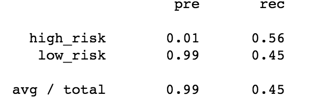
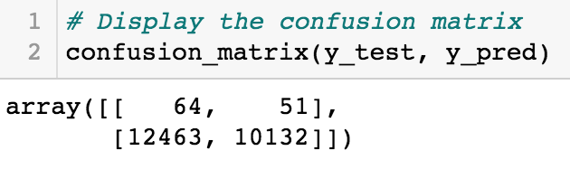
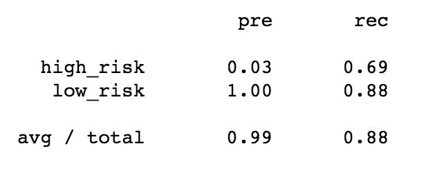
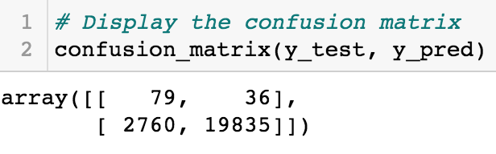
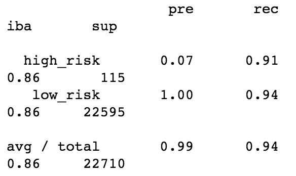
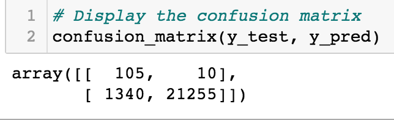

# Credit Risk Analysis
## Project Overview 
Credit risk is incredinbly difficult to classify and predict, as it is inherenlty unbalanced due to the fact that good loans outnumber risky loans. In this analyis, we will employ different techniques, such as resampling and boosting, to build and evaluate serveral supervised machine learning algorithms to evaluate LendingCLub data and predict credit risk. We will then use the results from said models to build a recommendation report on which would best aid LendingClub in predicting credit risk. 
##### Reources: 
		- Python 3.7 
		- Pandas 
		- imbalanced-learn libraries
		- scikit-learn libraries 

## Results 
### Naive Random Oversampling
- Balanced accuaracy score: 64.12%
- Precison score: 1%, when the model predicted "True" for high credit risk
- Recall score: Model correctly predicts 65% of high risk samples

### SMOTE
- Balanced accuaracy score: 63.91%
- Precison score for high credit risk: 1%, when the model predicted "True" for high credit risk
- Recall score: Model correctly predicts 58% of high risk samples

### Cluster Centroids
- Balanced accuaracy score: 50.25%
- Precison score for high credit risk: 1%, when the model predicted "True" for high credit risk
- Recall score: Model correctly predicts 56% of high risk samples

### SMOTEENN
- Balanced accuaracy score: 65.09%
- Precison score for hight credit risk: 1%, when the model predicted "True" for high credit risk
- Recall score:  Model correctly predicts 74% of high risk samples

### Balanced Random Forest Classifier 
- Balanced accuaracy score: 78.24%
- Precison score for high credit risk: 3%, when the model predicted "True" for high credit risk
- Recall score: Model correctly predicts 69% of high risk samples

### Easy Ensemble Classifier 
- Balanced accuaracy score: 92.69%
- Precison score for high credit risk: 7%, when the model predicted "True" for high credit risk
- Recall score: Model correctly predicts 91% of high risk samples

## Summary 
Based on the results of our analysis, the EasyEnsembleClassifier algorithm was the best fit for our analysis out of the six machine learning models used. The Ensemble Classifier model had the lowest number of Type II errors (false negavtive) compared to the other models. It also produced the highest accurancy score as well asrecall score, meaning 91% of the predictions made about high risk loans were correct. The model's precision score for detecting low risk loans was 100%. 

As for the other models, oversampling with RandomOverSampler and SMOTE resulted in low accuracy scores and recall scores, telling us the models were not as efficient in correctly predicting high risk samples. We used the ClusterCentroids algorithm to undersample the dataset, which produced the lowest score out of all six models. The accuracy score was 50% and the recall score was 56%, meaning the model only correctly predicted about half of the samples. The SMOTEENN model was a combination approach, both over and under sampling the data. The comnination approach resulted in an accuracy score of 65% and a recall score of 74%. Lastly, we used the BalancedRandomForestClassifier model (along with the EasyEnsembleClassifier) to reduce bias within the dataset. The results from this model showed a 78% accuracy score and a 69% recall score. 

After thorough analysis of the dataset and all six algorithms, I can confidently recommend using the Easy Ensemble Classiifer model for predicting credit risk, as it perfomed the best against the other models and our credit card credit dataset.